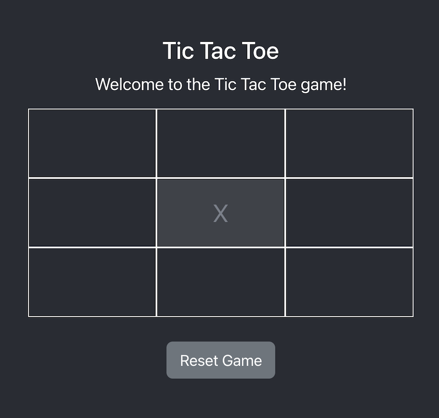
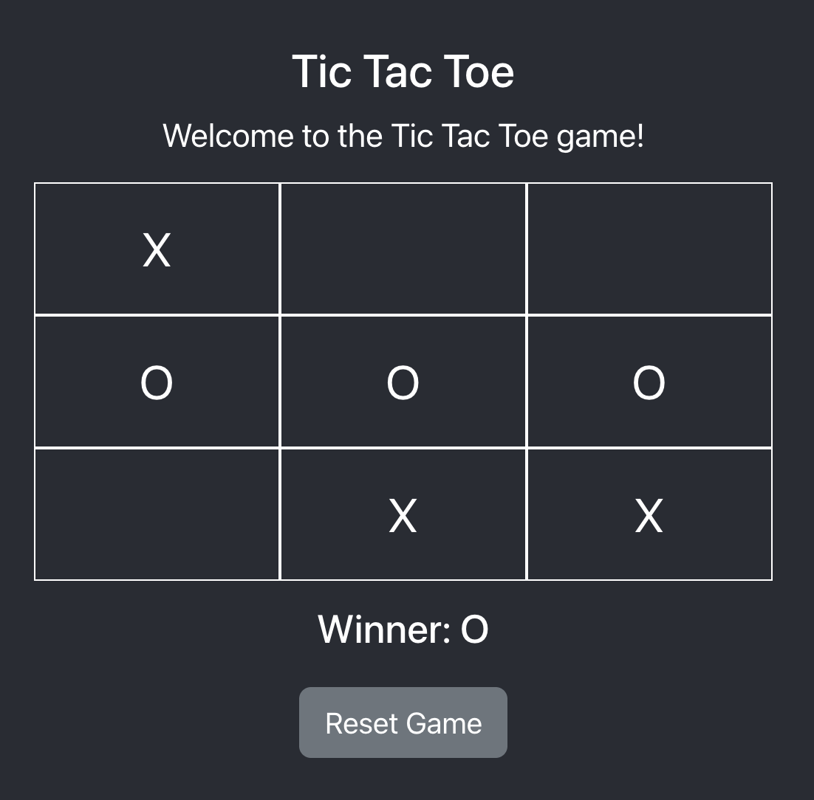

# Tic-Tac-Toe Game

Welcome to tic-tac-toe game. This is a simple two-player game.

## Used Technologies

- React
- TypeScript
- Bootstrap
- HTML
- CSS

## Demo

You can simply execute following codes on terminal to execute the game.

Get clone from repository:

```bash
git clone https://github.com/emrahgumus/tic-tac-toe
```

Install dependencies:

```bash
npm install
```

Execute application:

```bash
npm start
```

After execute application open this url on your browser: ``http://localhost:3000``

## Screenshots

You can find screenshots of the game below:



Show winner:


